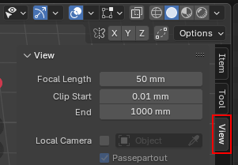
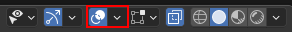

## Blender Metric Workspace Setup

### MeasureIt Add-on
1. Open the "Edit" menu, then "Preferences"
1. Open the "Add-ons" section
1. Enable the "MeasureIt" Extension then close the Preferences window
1. Open the "View settings" menu, expand the "MeasureIt" section, then the "Configuration" section

    

1. Change the default color to something like a bright red, or green

### Units, Viewport Grid, and View Clipping
1. "Scene" -> "Units"
    1. Unit System: Metric
    1. Unit Scale:  0.001
1. Open the "Viewport Overlay" menu

     

    1. Set Scale to 0.001

1. Open the "View settings" menu

    

    1. Focal Length: 50 mm
    1. Clip Start:   0.01 mm
    1. End:          10000 mm

